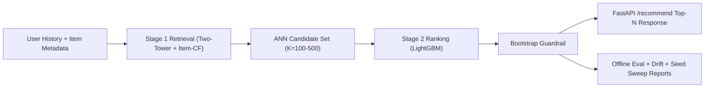

# Two-Stage Recommender: Retrieval (Two-Tower + Item-CF Hybrid) + Ranking (LightGBM)

[](https://github.com/lljw9999/Ai_Learning_Project/actions/workflows/ci.yml)
[](https://github.com/lljw9999/Ai_Learning_Project/actions/workflows/docker-image.yml)

A production-style **offline** recommender pipeline with:

1. Time-based data split (leave-two-out per user)
2. Stage 1 retrieval (Two-Tower embedding model + Item-CF hybrid + FAISS/Numpy ANN index)
3. Stage 2 ranking (LightGBM ranker with user/item/interaction features)
4. Offline evaluation (retrieval + ranking metrics + ablation + latency)
5. FastAPI serving endpoint with request logging and basic monitoring
6. Daily report script with metric history and drift checks

## Architecture

`User history + item metadata -> Hybrid Retrieval top-K -> Feature generation -> LightGBM ranking (guarded) -> Top-N API response`



### Stage 1: Retrieval

- Model: `recsys/retrieval.py::TwoTowerModel`
- User tower: user embedding + mean history embedding
- Item tower: item embedding projection
- Training: leakage-safe prefix->next-item events
- Loss: pairwise ranking loss (`-log(sigmoid(pos-neg))`)
- Negatives: popularity-weighted sampling (`count^0.75`) with seen-item filtering
- Hybrid retriever: Two-Tower candidates + Item-CF candidates fused with Reciprocal Rank Fusion (RRF)
- Serving: ANN search over item embeddings via FAISS if installed, otherwise Numpy fallback
- Warm-user optimization: user embeddings are cached at service startup
- Output: `retrieve_candidates(user) -> [item_idx]`

### Stage 2: Ranking

- Model: `lightgbm.LGBMRanker` (LambdaRank objective)
- Train data: query-event samples from the train split (time-ordered histories) with graded labels:
  - `2`: immediate next item
  - `1`: future positives in a short look-ahead window
  - `0`: other retrieved candidates
- Validation: early stopping on the validation split
- Features:
  - retrieval: score, rank, reciprocal rank
  - user: activity, recency, mean rating, genre affinity
  - item: popularity, year bucket, genre id, mean rating, age
  - interaction: category match, days since similar genre, item-CF co-occurrence score, user-item rating delta
- Final serving score: `rank_score + alpha * retrieval_score` (if ranker is enabled)
- Guardrail: ranker is enabled only if validation bootstrap confirms robust lift (`P(lift > 0)` and median lift threshold); otherwise serving falls back to retrieval-order
- Output: robust ranked candidates with regression-safe fallback

## Repository Layout

- `data/` download + preprocess scripts
- `retrieval/` two-tower training, index build, retrieval CLI
- `ranking/` ranker training + inference CLI
- `eval/` offline metrics + daily drift report
- `service/` FastAPI app + demo client
- `recsys/` shared library code
- `artifacts/` model/data/eval outputs (generated)
- `logs/` service and daily metric logs (generated)

## Quickstart

### One-command run (sanity)

```bash
make smoke
```

This runs data prep, lightweight retrieval/ranking training, offline eval, and writes artifacts.

### 1) Install dependencies

```bash
python -m venv .venv
source .venv/bin/activate
pip install -r requirements.txt
```

### 2) Data + split (MovieLens)

```bash
python data/download_movielens.py --dataset ml-latest-small
python data/preprocess.py --dataset-dir data/raw/ml-latest-small
```

### 3) Train retrieval + index

```bash
python retrieval/train.py --epochs 10 --embedding-dim 96 --num-negatives 20 --learning-rate 8e-4 --batch-size 512 --max-history-len 80
python retrieval/build_index.py
```

### 4) Train ranking

```bash
python ranking/train.py --retrieval-mode hybrid --train-candidate-k 120 --eval-candidate-k 500 --num-boost-round 600 --learning-rate 0.04 --num-leaves 127 --early-stopping-rounds 80 --n-jobs 1 --seed 42 --future-positive-window 10 --min-ranker-improve 0.005 --guardrail-confidence 0.95
```

### 5) Offline evaluation

```bash
python eval/offline_eval.py --retrieval-mode hybrid --retrieval-k 200 --ranking-k 10 --candidate-k-grid 100,200,500
```

### 6) Serve API

```bash
uvicorn service.app:app --host 127.0.0.1 --port 8000
```

Example request:

```bash
curl "http://127.0.0.1:8000/recommend?user_id=1&n=10&candidate_k=200"
```

Or demo client:

```bash
python service/client.py --user-id 1 --n 10
```

Ranker diagnostics (score distribution, score-label correlation, top-N before/after):

```bash
python ranking/debug_ranker.py --frame-path artifacts/ranking/ranker_val_frame.parquet --sample-users 5 --top-n 10
```

5-seed reproducibility sweep:

```bash
python eval/seed_sweep.py --seeds 11,22,33,44,55 --retrieval-mode hybrid --retrieval-k 200 --ranking-k 10 --candidate-k-grid 100,200,500
```

## Latest Single-Run Results (MovieLens Small, Time Split)

From `artifacts/eval/offline_metrics.json`:

| Metric | Value |
|---|---:|
| Retrieval Recall@100 (test) | 0.3207 |
| Retrieval Recall@200 (test) | 0.4391 |
| Retrieval-order NDCG@10 (test) | 0.0293 |
| Final Ranking NDCG@10 (test) | 0.0451 |
| Final Ranking MAP@10 (test) | 0.0326 |
| Absolute NDCG@10 Lift (test) | +0.0158 |
| Lift 95% CI over users (bootstrap) | [0.0037, 0.0288] |
| Latency p95 (ms, offline simulation, warmup-skipped) | ~55 (machine-load dependent) |
| Ranker Guardrail (`use_ranker_score`) | true |

Also from this run (`artifacts/eval/offline_metrics.json`), fair reranker baselines on the same frame:

| Reranker | NDCG@10 (test) |
|---|---:|
| LightGBM full model | 0.0451 |
| Logistic regression (same features) | 0.0288 |
| LightGBM (`retrieval_score` only) | 0.0267 |

## Reproducibility (5 Seeds)

From `artifacts/eval/seed_sweep.json` (full end-to-end runs with retrieval + ranking + eval):

| Metric | Mean | Std |
|---|---:|---:|
| Retrieval-order NDCG@10 | 0.0332 | 0.0032 |
| Final Ranking NDCG@10 | 0.0435 | 0.0013 |
| Absolute NDCG@10 Lift | +0.0103 | 0.0033 |
| Relative Lift (%) | 32.16 | 12.78 |
| Guardrail Pass Rate | 1.00 | - |

Seed-level lift checks:

- Positive absolute lift seeds: `5/5`
- Positive CI lower-bound seeds: `5/5` (CI lower bound > 0 from validation/bootstrap guardrail)
- Mean absolute lift 95% CI (bootstrap over seeds): `[0.0073, 0.0134]`
- Mean relative lift 95% CI (bootstrap over seeds): `[20.71, 44.64]`

Candidate-size robustness (`ranking_k=10`):

| Candidate K | Retrieval NDCG@10 (mean) | Ranking NDCG@10 (mean) | Relative Lift % (mean) |
|---|---:|---:|---:|
| 100 | 0.0332 | 0.0441 | 34.06 |
| 200 | 0.0332 | 0.0435 | 32.16 |
| 500 | 0.0332 | 0.0432 | 31.11 |

## Guardrail Logic

The ranker is enabled only if both conditions hold on validation:

1. `P(lift > 0) >= guardrail_confidence` from bootstrap over users
2. `median_lift >= min_ranker_improve`

Current default command-level thresholds:

- `guardrail_confidence = 0.95`
- `min_ranker_improve = 0.005` (NDCG@10 absolute)

Leakage checks are enforced in training (`recsys/ranker_dataset.py`) and fail hard on temporal violations; counts are logged in `artifacts/ranking/train_metrics.json`.

## Baseline Benchmarks

Run:

```bash
python eval/retrieval_baselines.py --top-k 200
```

From `artifacts/eval/retrieval_baselines.json`:

| Model | Recall@100 (test) | NDCG@10 (test) |
|---|---:|---:|
| Popularity baseline | 0.2072 | 0.0217 |
| Item-CF baseline | 0.3125 | 0.0338 |
| Hybrid retrieval (current) | 0.3257 | 0.0356 |

## Monitoring + Daily Reports

### Per-request logging (service)

- File: `logs/service_requests.jsonl`
- Fields: timestamp, user_id, candidate_count, latency_ms, error

### Runtime metrics endpoint

- `GET /metrics`
- Returns: request count, p50/p95 latency, error rate

### Daily evaluation + drift

```bash
python eval/daily_report.py --retrieval-mode hybrid --retrieval-k 200 --ranking-k 10
```

- Appends metrics to `logs/daily_metrics.csv`
- Includes PSI drift checks for:
  - `user_activity`
  - `item_popularity`
  - `retrieval_score`

`eval/offline_eval.py` additionally writes:

- candidate-size robustness curves (`candidate_k_sweep`)
- reranker baseline comparisons
- train/val/test drift report (PSI + KL) with warning if guardrail passes under high drift

## Time-Split Evaluation Design

The preprocessing split is per-user, timestamp ordered:

- train: all but each user's last two interactions
- val: second-to-last interaction
- test: last interaction

This avoids future leakage and keeps evaluation aligned with realistic recommendation timing.

## Failure Modes and Production Plan

### Known failure modes

- Cold-start users/items
- Popularity bias
- Concept/time drift
- Feedback loops from exposure bias
- Offline metric optimism without exposure/impression logs

### Production upgrades

- A/B testing framework for online CTR/watch-time metrics
- Exploration policy (epsilon-greedy or contextual bandit)
- Guardrails: diversity, freshness, hard filters, business constraints
- Better retrieval (in-batch negatives, hard negatives, sequence towers)
- Better ranking labels (impressions/CTR logs instead of proxy labels)

## Notes

- If `faiss-cpu` is unavailable, retrieval uses a Numpy fallback index.
- The code is organized to make swapping datasets straightforward (`data/preprocess.py` is the integration point).
- This project is a production-style **offline pipeline with serving + guardrails**, not a deployed online recommender with live A/B feedback loops.

## Resume-Ready Line

`Built a production-style two-stage recommender (two-tower + hybrid retrieval, LightGBM LTR reranker) with strict temporal leakage enforcement, drift reporting, bootstrap guardrails, and multi-seed/K-sweep robustness; achieved +32% mean relative NDCG@10 lift over retrieval-order across 5 seeds.`

## Tests

```bash
python -m pytest
```

## Docker

Build and run API:

```bash
docker compose build
docker compose up
```

Service will be available at `http://127.0.0.1:8000`.

## GitHub Automation

Included workflows:

- `CI` (`.github/workflows/ci.yml`): compile + unit tests on push/PR
- `Docker Image` (`.github/workflows/docker-image.yml`): validates Docker build on push/PR
- `Smoke Pipeline` (`.github/workflows/smoke-pipeline.yml`): manual end-to-end training/eval smoke run

Additional GitHub config files:

- Dependabot: `.github/dependabot.yml`
- Issue templates: `.github/ISSUE_TEMPLATE/`
- PR template: `.github/pull_request_template.md`
- CODEOWNERS: `.github/CODEOWNERS`
- Security policy: `SECURITY.md`
- Contribution guide: `CONTRIBUTING.md`
- Branch protection recommendations: `docs/GITHUB_SETUP.md`

Apply branch protection/settings automatically (after `gh auth login`):

```bash
make github-harden
```
